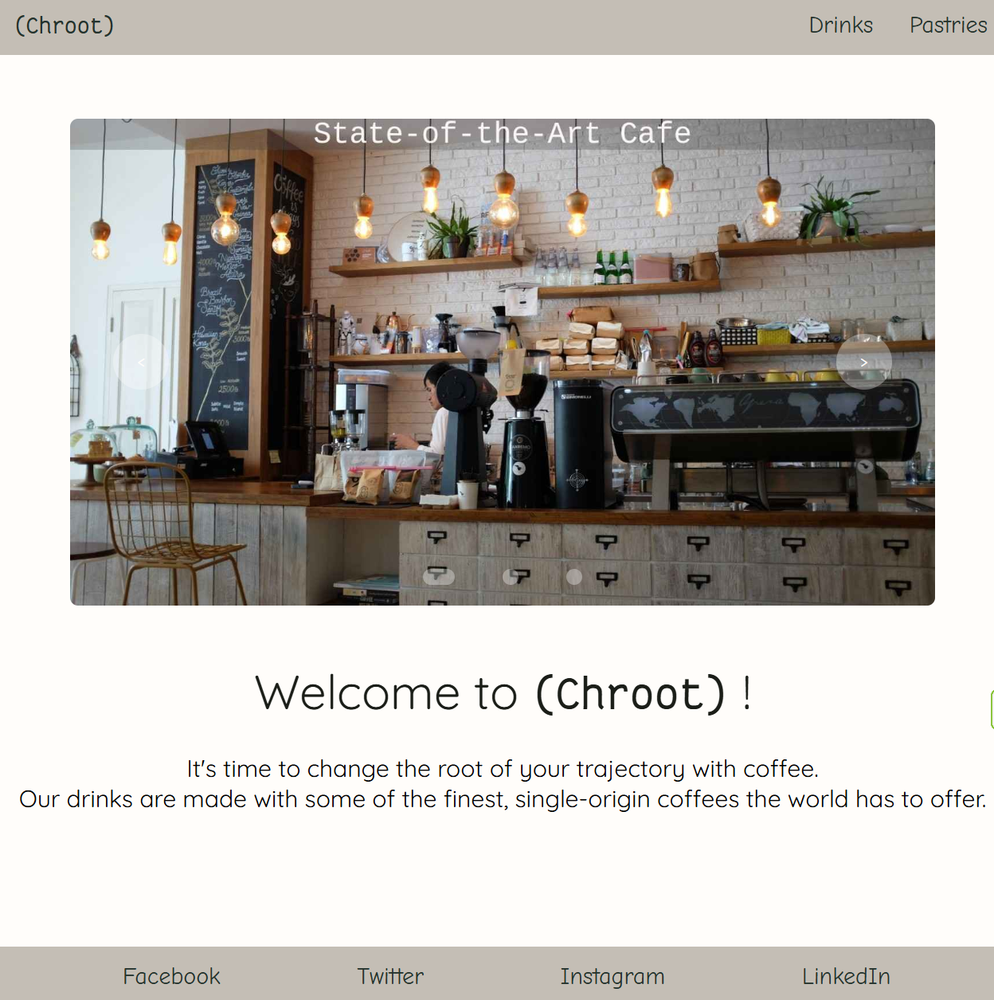

# Chroot
A fictional coffee shop. This website was developed with three pages with external links to social media pages and more.

## 🔗 Link
[chroot](https://cfy98.github.io/CodeNation-Chroot-Coffee-Shop/)

## 🌐 Website structure
```
chroot
 └── Landing Page
      ├── Navbar
      |    ├── Drinks Page
      |    └── Pastries Page
      |
      └── Social Media Navbar
          ├── Facebook
          ├── Twitter/X
          ├── Instagram
          └── LinkedIn 
```

## ✨ Features

- **Multi-page navigation** — a nav bar linking to dedicated Drinks and Pastries pages, keeping content cleanly separated.
- **Image carousel/slider** — a rotating hero section showcasing the café's interior, coffee beans, and latte art with previous/next controls.
- **Terminal-inspired branding** — A Hidden Easter-Egg which leans into a developer aesthetic.
- **Responsive hero images with text overlays** — full-width lifestyle photography with descriptive captions baked into the images.
- **Social media links** — footer links to Facebook, Twitter/X, Instagram, and LinkedIn.
- **Thematic copywriting** — the tagline "It's time to change the root of your trajectory with coffee" ties the tech theme into the brand voice.

## Project Structure
```
chroot/
│
├── Fonts              # Folder for the fonts used on the site
├── Images             # Folder for the images used on the site
├── favicon.ico        # Web icon
├── index.html         # The landing page
├── drinks.html        # The drinks page
├── pastries.html      # The pastries page
├── style.css          # Encompasses the styling
├── slideshow.js       # Encompasses the carousel for landing page
├── LICENSE       
└── README.md
```
## ⛏️ Built With
- **HTML**: Provides basic structure and layout of the website.
- **CSS**: Used for styling the website and hiding easter eggs.
- **JavaScript**: Used to create an automatic slideshow with navigation buttons.

## 📄 License
This project is licensed under the **MIT License**.
