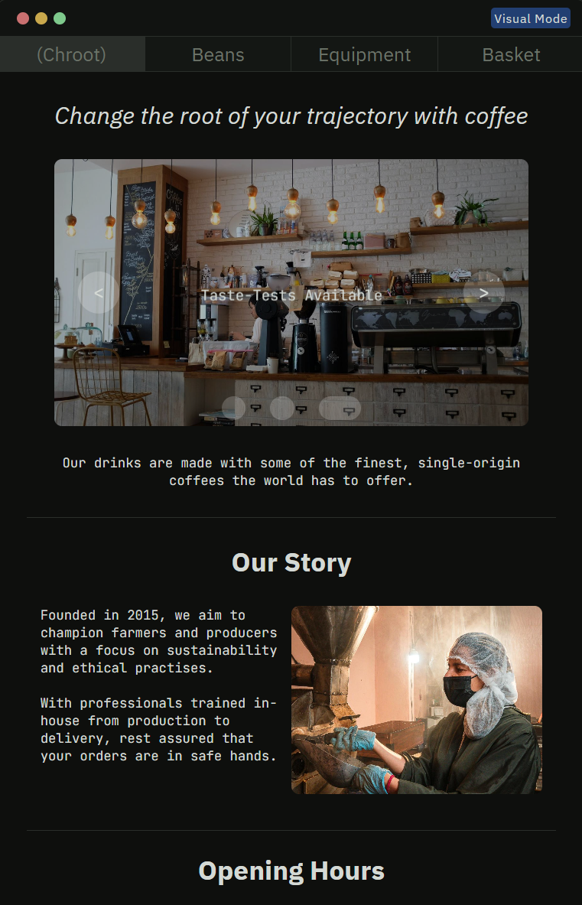
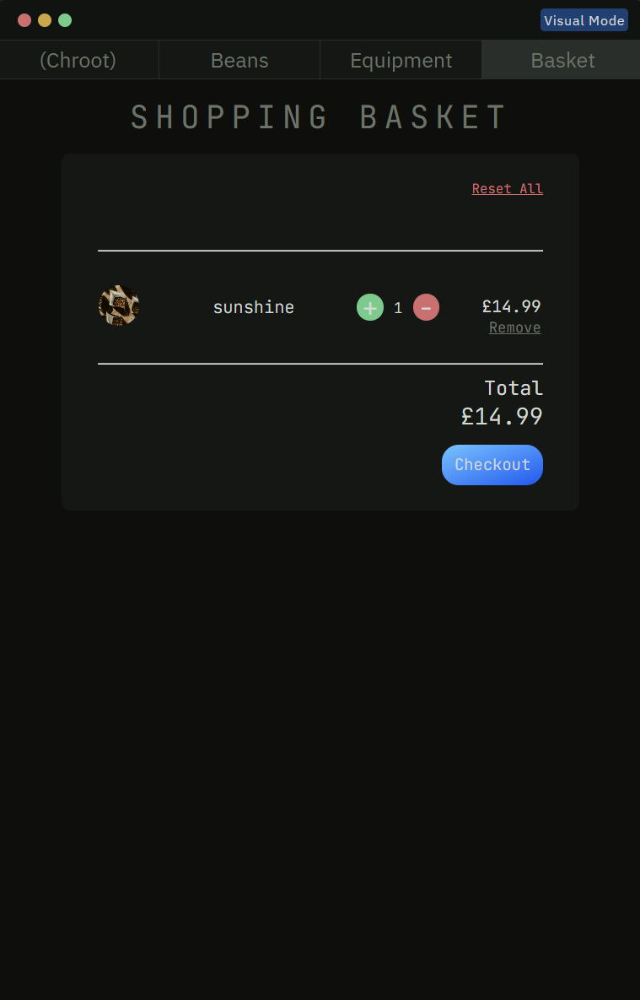
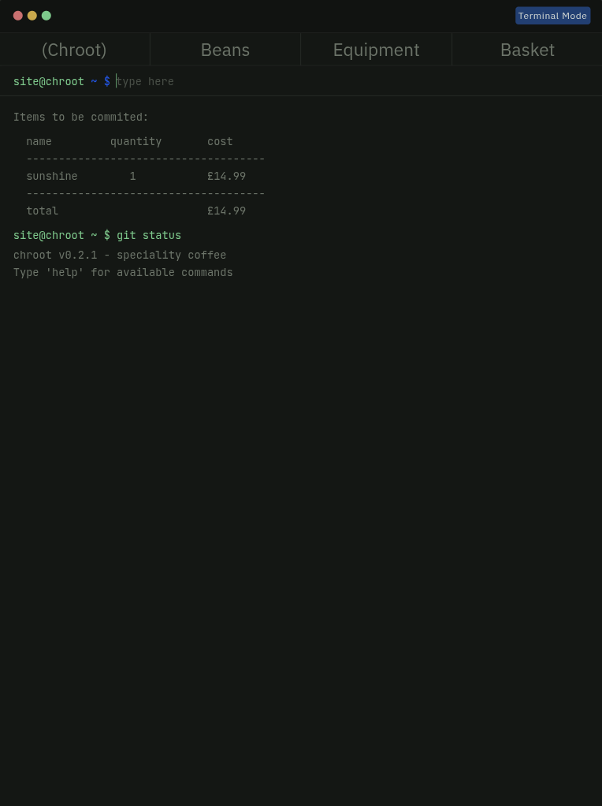
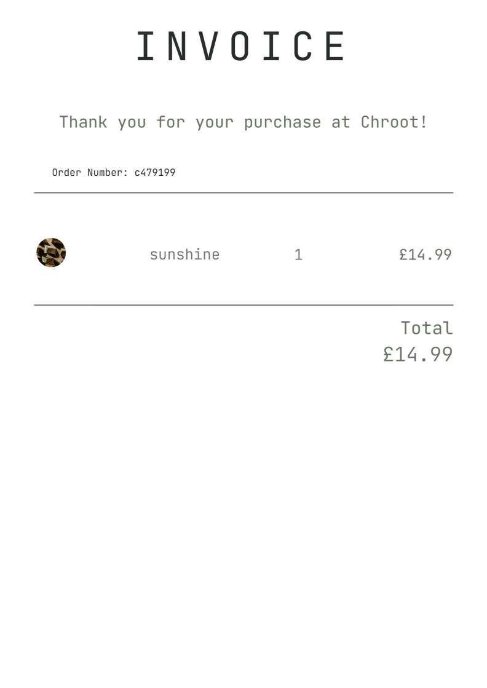

# Chroot

A concept e-commerce UI built around a terminal interface. Alongside the conventional point-and-click, users can interact with the shop using familiar git commands to browse, stage, and commit items to their basket.

Iterated on user feedback from external testers to introduce new features from v0.2.1 onwards.

## ✨ Features

- **Responsive Basket UI** — Dynamic cart rendering with real-time quantity management and state synchronisation across components.
- **Accessibility** — ARIA live regions with custom announcements to ensure full screen reader compatibility.
- **Persistence** — localStorage for live basket state across pages, with local state object for pre-basket quantity adjustment.
- **SPA Routing** — React Router for seamless client-side navigation across UI modes.
- **Client-side PDF Generation** — On-demand receipt generation via deferred module import of html2pdf, with print-state cleanup via try/finally.

## 💻 Visual Mode Features

The UI features dual modes which users can select depending on their preferences. Visual mode offers the more traditional e-commerce UI experience. 

- **Toast Notifications** — Non-blocking user feedback for basket interactions.
- **State Memory** — In-memory state object for adjusting item quantities before adding to basket.

## ⌨️ Terminal Mode Features

Users can switch to Terminal mode if they prefer working in a terminal.

- **Git-inspired Commands** — Git-style commands (add, reset, status, commit, log) for basket interaction.
- **Keyboard Navigation** — History indexes accessible via arrow-keys for fast lookup.
- **Autocomplete** — Tab completion for commands and arguments based on the current input.

## 🔗 Link

[chroot](https://chroot-web.vercel.app/)

## 📸 Screenshots (Tablet View)






## Project Structure

```
Chroot/
├── .gitignore
├── index.html
├── LICENSE               — Apache 2.0 License 
├── README.md             — this file
├── CHANGELOG.md          — log of all iterative changes between versions
├── vercel.json
├── vite.config.js
├── package.json
├── package-lock.json
│
├───public/               — static assets served directly
│    ├── favicon.ico
│    ├── Images
│    └── screenshots
│
└───src/
     ├───App.jsx          — root component, routing, and layout
     ├───Main.jsx         — React entry point 
     ├───components/      — reusable React components
     ├───css/             — stylesheets for global styles and each page/component
     ├───git/             — git commands logic for terminal
     ├───pages/           — React page components
     ├───terminal/        — terminal emulator and commands
     └───tools/           — shared utilities, state, basket and purchase logic
```

## Installation

Prerequisites:

- npm

1. Clone the repository

```
git clone https://github.com/CFY98/Chroot.git
```

2. Enter repository

```
cd Chroot
```

3. Install dependencies

```
npm install
```

4. Start development server

```
npm run dev
```

5. Build for production
```
npm run build
```

## 📌 Future Developments
1. **Aesthetic Overhaul**: Full UI redesign (approx. start Summer 2026).
2. **PostgreSQL**: Database to store products and orders (approx. start Fall 2026).
3. **Backend Cart System**: Save carts per user, update quantities and persist data (approx. start Fall 2026). 
4. **Backend API**: Node.js to handle requests from the UI and interact with the PostgreSQL database (approx. start Winter 2026).
5. **Wishlist**: Implement git-style command, Git stash, alongside a button for Visual mode to save products, backed by database storage (approx. start Winter 2027).

## ⛏️ Tech Stack

- **HTML**: Provides basic structure and layout of the website.
- **CSS**: Used for styling the website.
- **JavaScript**: Functional terminal with Git-style commands, localStorage as a cross-page communication bridge, and DOM manipulation via useEffect for slideshow and scroll transitions.
- **React**: Component-based UI with hooks, CSS modules, and React Router for client-side navigation.
- **ARIA**: Live regions, semantic roles and labels for screen reader support.
- **Vite**: Development server and bundler.
- **Vercel**: Hosts the site with a rewrite rule to support React Router client-side navigation.

## 📄 License

This project is licensed under **Apache 2.0**.
