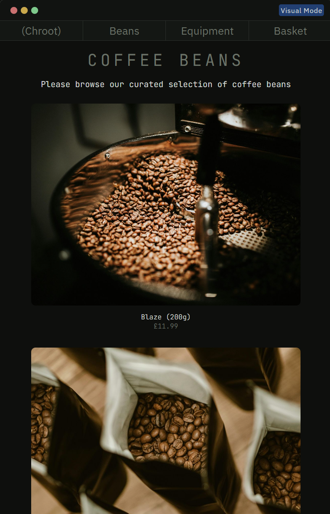
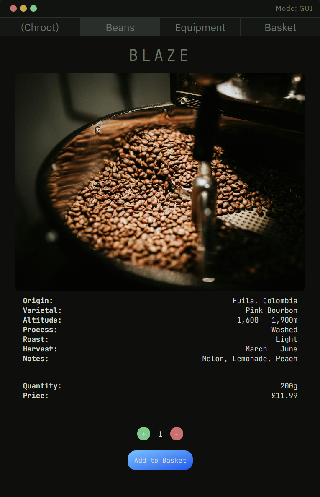
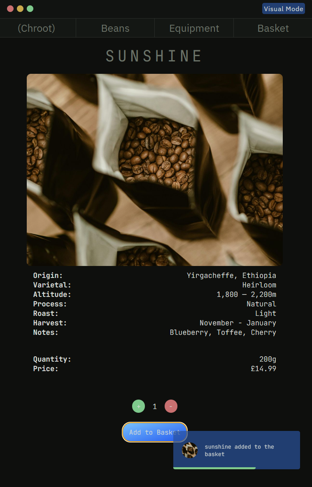
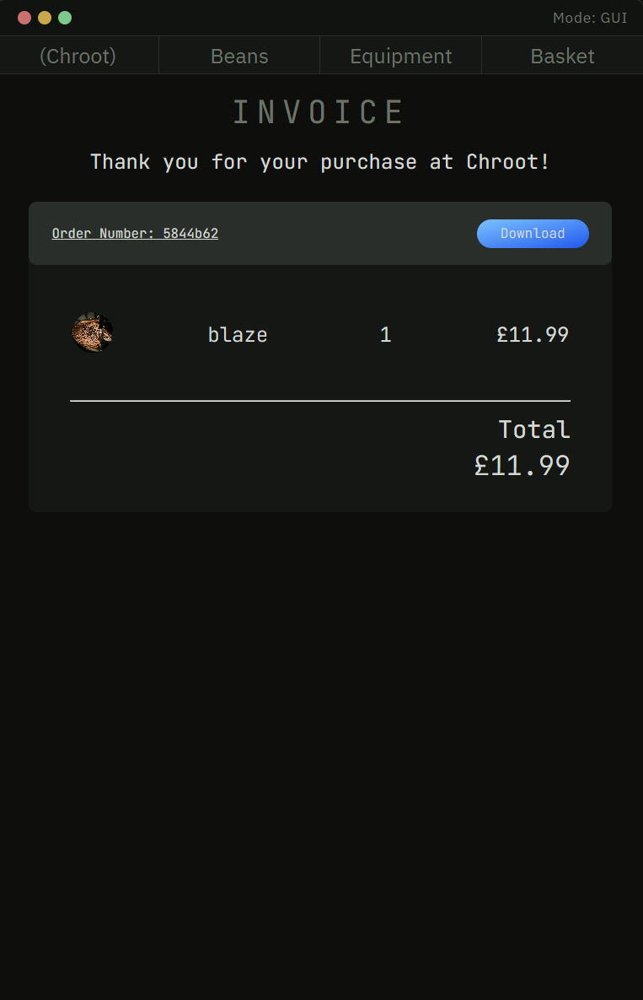
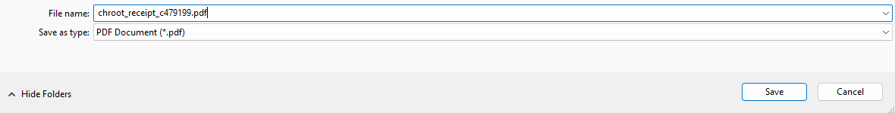

# Chroot

A fictional e-commerce UI built around a terminal interface. Users interact with the shop using familiar git commands to browse, stage, and commit items to their basket.

After sending to testers, new features were added based on user-feedback.

## ✨ Features

- **Responsive Basket UI** — Dynamic cart rendering with item quantities.
- **Local Storage** — Live basket updates across pages via localStorage.
- **SPA Routing** — Changed the iframes of V2 for convenient navigation for the GUI mode.
- **PDF Generation** — Client-side PDF generation via html2pdf library.
- **Screen Reader Announcer** — ARIA live regions with custom announcements to assist screen reader users.

## 💻 GUI Mode Features

The UI has been updated to feature both a GUI and a TUI mode depending on the user's preference so the user no longer has to use the terminal should they see fit.

- **Toast Notifications** — Informs users when items are added to the basket.
- **State Memory** — locally-saved object for adjusting item quantities before adding to basket.

## ⌨️ TUI Mode Features

Users can switch to TUI mode if they prefer working in a terminal.

- **Keyboard Navigation** — History indexes accessible via arrow-keys and tab for autocomplete, a'la inspiration from a terminal interface.
- **Git commands** — Inspired use of Git Commands to interact with the basket via add, reset, status, commit, and log.

## 🔗 Link

[chroot](https://chroot-web.vercel.app/)

## 📸 Screenshots (Tablet View)











## Project Structure

```
chroot/V3
|   .gitignore
|   index.html
|   LICENSE
|   package-lock.json
|   package.json
|   README.md
|   vercel.json
|
├───public — static assets served directly (images, favicon, pages)
|   ├───pages — HTML pages organised by category
│   |    ├───coffee
│   |    ├───gear
│   |    ├───tabs
│   |    └───ui
│   |
│   ├───favicon.ico
|   ├───Images
|   └───screenshots
│
└───src
    ├───css  — stylesheets for each page/component
    ├───product__purchase — basket, buy, and receipt logic
    ├───terminal — terminal emulator and commands
    └───tools — shared utilities, router, and state
```

## Installation

Prerequisites:

- npm

1. Clone the repository

```
git clone https://github.com/CFY98/Chroot.git

```

2. Install dependencies

```
npm install

```

3. Start development server

```
npm run dev

```

4. Build for production

```
npm run build
```

<<<<<<< HEAD
=======
## 📌 Future Developments

- **PostgreSQL**: Database to store products and orders.
- **Wishlist**: Implement git-style command, Git stash, alongside a button for Visual mode to save products, backed by database storage.
- **Backend Cart System**: Save carts per user, update quantities and persist data. 
- **Backend API: Express.js to handle requests from the UI and interact with the PostgreSQL database.

>>>>>>> 68b5ba1 (docs added and updated Future Developments section)
## ⛏️ Tech Stack

- **HTML**: Provides basic structure and layout of the website.
- **CSS**: Used for styling the website.
- **JavaScript**: Used to create a functional terminal with git-style commands and infrastructure to tracks items in the basket. localStorage acts as the communication bridge between the terminal page and the basket, with a setInterval polling for changes and dynamically rendering cart items into the DOM via innerHTML and appendChild. Event delegation handles clicks on dynamically created elements.
- **ARIA**: Live regions, semantic roles and labels for screen reader support.
- **Vite**: Deployment server and bundler.
- **Vercel**: Hosts the site with a custom rewrite rule for SPA routing

## 📄 License

This project is licensed under the **MIT License**.
