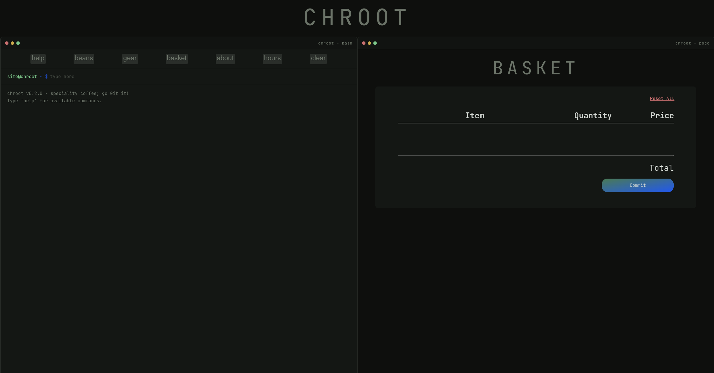
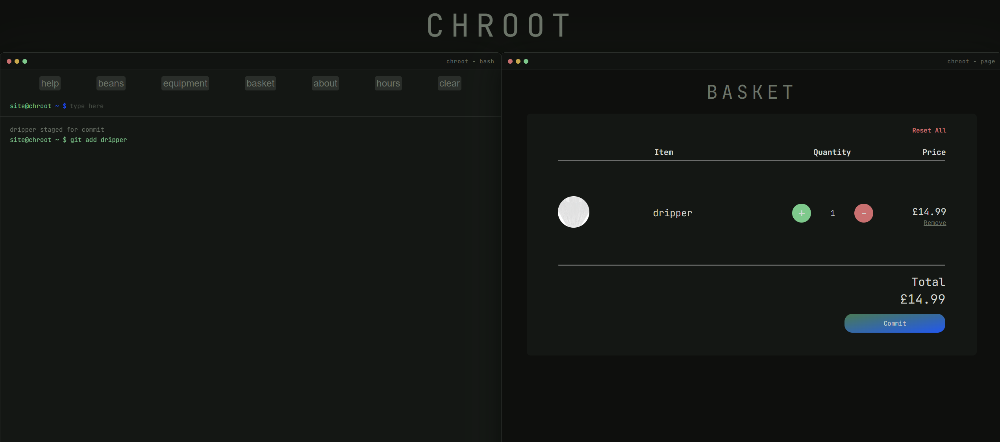
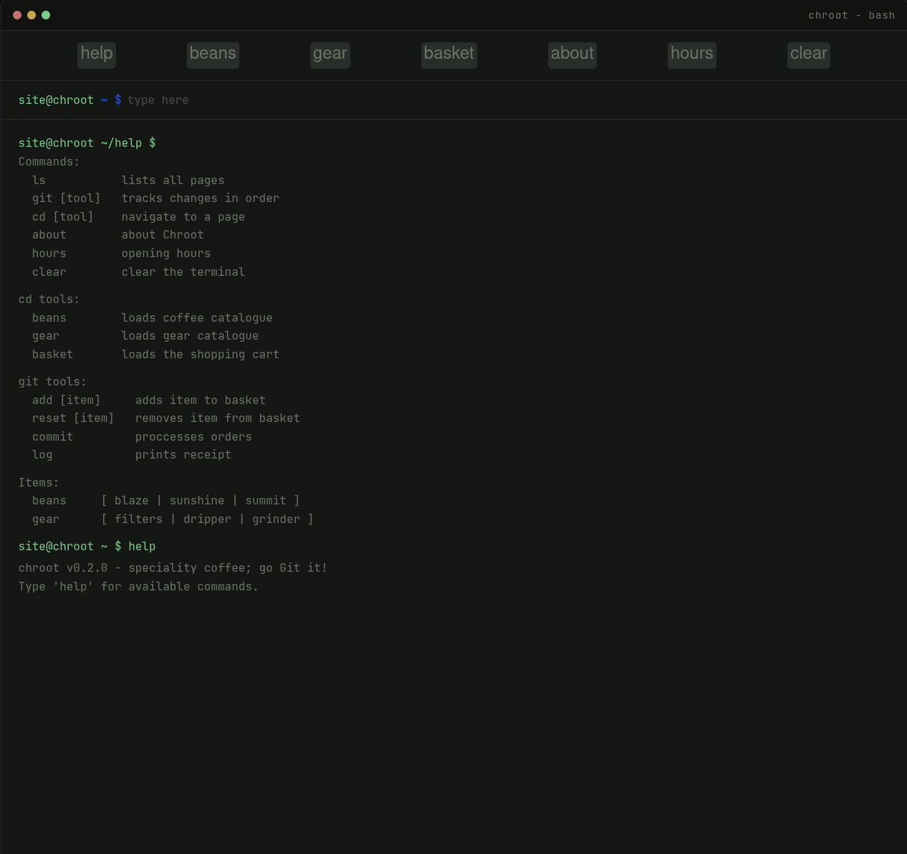
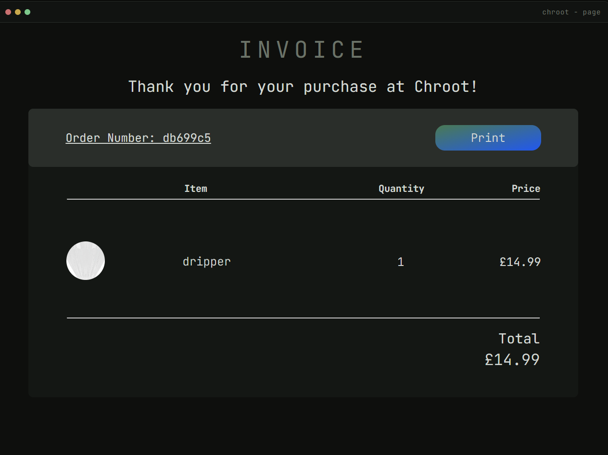
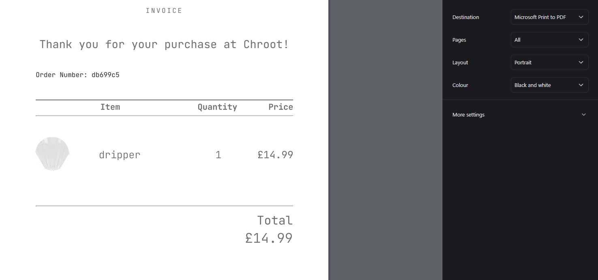

# Chroot

A fictional e-commerce UI built around a terminal interface. Users interact with the shop using familiar git commands to browse, stage, and commit items to their basket. Initially, the project was hosted on GitHub Pages but has since migrated to **Vercel** for better iframe support.

## 🔗 Link

[chroot](https://chroot-web.vercel.app/)

## 🌐 Website structure

```
chroot/V2
 │
 └── Landing Page
      ├── Terminal
      |    ├── Beans Page
      |    ├── Equipment Page
      |    └── Basket Page
      |         └── Receipt Page
      |
      |
      └── Social Media Navbar
          └── GitHub
```

## ✨ Features

- **Terminal Input** — Git-style commands for adding and removing items in the terminal window.
- **Responsive Basket UI** — Dynamic cart rendering with item quantities.
- **Keyboard Navigation** — History indexes accessible via arrow-keys and tab for autocomplete, a'la inspiration from a terminal interface.
- **Local Storage** — Live basket updates across pages via localStorage.
- **Webpages as iframes** — Webpages load in-house to mimic windows on a GUI.
- **PDF Generation** — Client-side PDF generation via the brower's native window.print() API.
- **Screen Reader Announcer** — ARIA live regions with custom announcements to assist screen reader users.

## 📸 Screenshots (Desktop View)







## Project Structure

```
chroot/V2
│
├── Images                  # Folder for the images used on the site
│     ├──favicon.ico        # Web icon
│     └──images.jpg*6       # 6 jpgs for products
│
├── main                    # Folder for the main stylesheet and landing page
│     ├──index.html         # Landing page with terminal interface
│     └──style.css          # Main stylesheet which contains the house style
│
├── styles                  # Folder for additional stylesheets
│     ├──pages.css          # Stylesheet for beans and equipment html files
│     ├──basket.css         # Stylesheet for basket.html
│     ├──receipt.css        # Stylesheet for receipt.html
│     ├──terminal.css       # Stylesheet for terminal window on index.html
│     └──pdf.css            # Media query for PDF printing
│
├── scripts                 # Folder for additional javascript files
│     ├──announcer.js       # Contains function to generate text and audio for screenreaders
│     ├──assets.js          # Encompasses the pages, item selection, and suggestion button names
│     ├──basket.js          # Encompasses UI features for basket.html
│     ├──terminal.js        # Contains the functions and commands for the terminal interface
│     └──receipt.js         # Contains receipt generation logic for the print button on receipt.html
│
|
├── screenshots             # Folder for screenshots of the desktop view
│     └──screenshots*6      # Screenshots used in this README
│
├── LICENSE                 # MIT License
└── README.md               # This page
```

## ⛏️ Tech Stack

- **HTML**: Provides basic structure and layout of the website.
- **CSS**: Used for styling the website.
- **JavaScript**: Used to create a functional terminal with git-style commands and infrastructure to tracks items in the basket. localStorage acts as the communication bridge between the terminal page and the basket, with a setInterval polling for changes and dynamically rendering cart items into the DOM via innerHTML and appendChild. Event delegation handles clicks on dynamically created elements.
- **ARIA**: Live regions, semantic roles and labels for screen reader support.

## 📄 License

This project is licensed under the **MIT License**.
